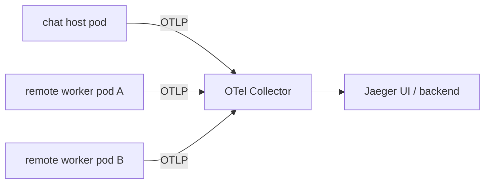
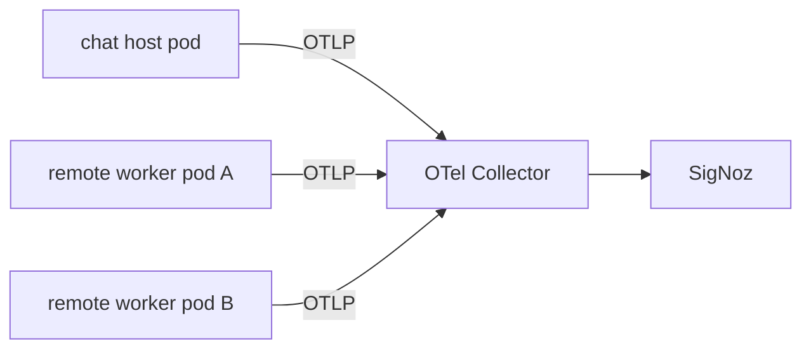

# v57 Agent Tracing Frameworks Deep Research

Date: 2026-03-29

## Executive Summary

市场上的主流做法，已经明显分成两层：

1. **通用 distributed tracing 底座**：通常是 `OpenTelemetry + Collector + 一个后端/UI`，后端常见是 Jaeger、SigNoz、Tempo/Grafana、OpenObserve。[1][2][3][5][6][7][8][9][10][11][18][19]
2. **Agent/LLM 语义层 tracing**：通常是 Phoenix、Langfuse，强调 prompt、tool、agent、evaluation、session 等更贴近 AI 工作流的可视化。[12][13][14][15][16][17]

如果把你的当前目标限定在 **v57 的 host ↔ subagent actor 化**，我不建议直接把 Phoenix/Langfuse 这类产品当成唯一底座。更稳的路线是：**先用 OpenTelemetry 统一 local + remote 的观测语义，再把数据送到一个通用 tracing 后端**。[1][2][3]  
在这个前提下：

- **最快、最轻、最适合先在 k3s 三节点跑通的方案**：`OpenTelemetry + OTel Collector + Jaeger`。[2][3][5][6]
- **如果你想一个 Web UI 里同时看 traces / logs / metrics / service map，并且能继续向“观测整个集群”演进**：`OpenTelemetry + OTel Collector + SigNoz` 是更均衡的单体选择，但明显比 Jaeger 重。[7][8][9][24]
- **如果你之后更关心 agent/tool/prompt 语义，而不是基础设施观测**：Phoenix 比 Langfuse 更轻，更适合作为第二层补充；Langfuse 功能很强，但自托管依赖更重，更像 LLM 工程平台，而不是你当前 v57 的第一观测底座。[12][13][14][15][16][17]

## Key Findings

- **OpenTelemetry 是 v57 最匹配的观测协议层**。它天然支持 spans、events、links、status、resource attributes，以及 vendor-agnostic collector fan-out；这些能力正好能映射 `execution_id`、`message_id`、`seq`、`down`、`supervisor decision`、local/remote transport 统一语义。[1][2][3]
- **v57 actor 语义里最关键的不是“树形 parent-child”，而是“异步因果关系”**。OpenTelemetry 的 `Span Links` 比单纯 parent-child 更适合表达 `spawn`、`fan-out`、`retry`、`replay`、`reconnect` 这类关系。[2]
- **OpenTelemetry 已经开始定义 GenAI agent / tool 的语义约定，但仍处于 Development 状态**。这意味着你可以对模型/tool 部分尽量贴近 `gen_ai.*` 语义；但对 v57 专属的 actor/mailbox/supervisor 语义，短期仍应使用你自己的 `oa.actor.*` / `oa.mailbox.*` 属性命名空间。[4]
- **Jaeger 是最轻的“第一跳 UI”**。它支持 Kubernetes、Helm、现代 Web UI、拓扑图，并能接收 OTLP；但它的 UI 仍然更偏通用 tracing，对 agent/prompt/tool 语义不够强。[5][6]
- **SigNoz 是最均衡的一站式选择**。它原生站在 OpenTelemetry 上，Kubernetes/Helm 成熟，Python 与 OTel 接入顺滑，还已经开始提供 LLM observability 集成页；代价是它依赖 ClickHouse 和更完整的可观测性组件，重量明显高于 Jaeger。[7][8][9][24]
- **Tempo 更适合“已经有 Grafana 栈”的团队**。它本身是高规模 tracing backend，依赖对象存储，Grafana UI、TraceQL、Service Graph 都很强；但如果你现在还没有完整 Grafana/Mimir/Loki 体系，落地复杂度并不低，而且 Tempo 自身不带认证层，需要反向代理兜住。[10][11]
- **Phoenix 很适合做 AI/agent 语义观察层，但不适合作为唯一集群观测底座**。它基于 OpenTelemetry 和 OpenInference，支持 Python、Kubernetes、Helm、自托管，也确实比较轻；但它的重心是 tracing + evals + prompt/debug，而不是整套 cluster observability。[12][13][14]
- **Langfuse 更像“LLM 工程平台”而不是“v57 actor tracing 底座”**。它本质上也建立在 OpenTelemetry 上，Python SDK 很成熟，agent/tool/chain 类型也丰富，但默认自托管会把应用和 PostgreSQL、ClickHouse、Redis 一起拉起来，重量偏大。[15][16][17]
- **OpenObserve 是一个值得留意的替代项**。它支持 OTLP、Python、Web UI、service map、logs-traces correlation，单节点 quickstart 很轻；但它当前公开文档给人的感觉是：轻量单节点体验不错，HA/enterprise 路线相对更重，产品边界也更偏“统一观测平台”而非专门 agent tracing。[18][19][20][21]

## Market Patterns

### Pattern A: OTel as substrate, generic backend as UI

这是当前最主流、最稳的模式：

- 应用/agent/runtime 里接 OpenTelemetry SDK
- 统一送到 OTel Collector
- Collector 再转发到 Jaeger / SigNoz / Tempo / OpenObserve / 商业后端

优点是：

- 你的 SDK 不被某一家后端绑死
- local / remote / k3s / 非 k3s 都可以共用同一套埋点模型
- 将来要换 UI/backend，通常不用重写埋点，只需要改 Collector/exporter 配置

这和 v57 的分层思路高度一致：**actor runtime 负责语义正确性，tracing 只负责观测镜像**。[1][3]

### Pattern B: OTel/OpenInference as substrate, agent-specific UI as overlay

Phoenix、Langfuse 代表的是这条路线：

- 它们不只看 spans
- 它们想看 prompt、tool、agent、retrieval、evaluation、session、cost、token
- 更适合排查“这个 agent 为什么做了这个决策”

这类产品对 AI 工作流很友好，但通常不应该替代你对 **transport / mailbox / supervisor / node / pod** 的底层观测。[12][15]

### Pattern C: 双层组合

很多团队最终会落在“双层组合”：

- 底层：OTel + 通用 tracing backend，看系统与跨服务调用
- 上层：Phoenix / Langfuse，看 prompt/tool/agent 语义

对你现在的阶段，我认为这条路 **最终可能成立**，但 **第一阶段不应该一起上**。v57 现在最缺的是 actor 通信基础的可观测性，不是 prompt analytics。

## Evaluation Criteria

本次比较，我主要按这几个维度打分：

- **Python 支持**
- **是否有现成 Web UI**
- **是否适合自托管到 k3s**
- **轻量级程度**
- **对通用 distributed tracing 的适配度**
- **对 agent/LLM 语义的表现力**
- **与 v57 actor 需求的匹配度**

## Candidate Comparison

| 方案 | Python | Web UI | k3s/Helm | 轻量级 | 通用 tracing 能力 | Agent/LLM 语义 | 与 v57 匹配度 | 结论 |
| --- | --- | --- | --- | --- | --- | --- | --- | --- |
| OpenTelemetry + Jaeger | 高 | 高 | 高 | 高 | 高 | 低到中 | 高 | 最适合先跑通 v57 观测 |
| OpenTelemetry + SigNoz | 高 | 高 | 高 | 中 | 很高 | 中 | 很高 | 最均衡的一站式方案 |
| OpenTelemetry + Tempo + Grafana | 高 | 高 | 高 | 中 | 很高 | 中 | 高 | 更适合已有 Grafana 栈 |
| Phoenix | 高 | 高 | 高 | 中高 | 中 | 很高 | 中高 | 更适合作为 agent 语义层 |
| Langfuse | 高 | 高 | 高 | 低到中 | 中 | 很高 | 中 | 更像 LLM 工程平台 |
| OpenObserve | 高 | 高 | 中到高 | 中高 | 高 | 中 | 中高 | 值得关注，但不是首选 |

## Detailed Analysis

### 1. OpenTelemetry + Collector

这不是一个“带完整 Web UI 的现成产品”，但它是最重要的 **协议与埋点底座**。[1][2][3]

OpenTelemetry Python 已经很成熟，Tracing 与 Metrics 是 stable，安装路径也直接；Collector 则是一个 vendor-agnostic 的中间层，可以统一接收、处理、再导出到不同后端。[1][3]

对 v57 来说，它最重要的价值不是“有一个 UI”，而是：

- 让 local subagent 与 remote subagent 说同一种观测语言
- 让 future backend choice 与 SDK core 解耦
- 允许你先发到 Jaeger，后面再无痛切到 SigNoz 或 Tempo

另外，OpenTelemetry 的 span model 已经明确包含：

- span attributes
- span events
- span links
- span status

其中 `span links` 对 actor 场景尤其关键，因为 child execution、replay、retry、fan-out 并不总是严格 parent-child；很多时候，它们只是“有因果关系的异步工作”。[2]

同时，OpenTelemetry 现在已经有 GenAI agent / tool semantic conventions，但状态仍是 Development，所以我的建议是：

- **模型调用、tool 调用**：尽量贴 `gen_ai.*`
- **actor / mailbox / supervisor / down / seq**：继续用你自己的 `oa.*` 语义

这样既不被未来标准化拖慢，也不会把 v57 的 actor 语义硬塞进并不稳定的 GenAI 规范里。[4]

### 2. Jaeger

Jaeger 的优势非常明确：**足够经典、足够轻、够用、容易在 Kubernetes 上起起来**。[5][6]

它的官方特性里包括：

- modern Web UI
- topology graphs
- service performance monitoring
- OTLP 接入
- Kubernetes Operator / Helm 支持

而且它的 tracing 视角本身就允许 directed acyclic graph，而不只是树，这点对 actor/fan-out/retry 也比一些只强调调用树的 UI 更自然。[5]

对 v57 的实际意义：

- 你很快就能看到 host、worker、child execution 的 trace
- 很快就能验证 `spawn -> stream -> down`
- 很快就能看 `reconnect/replay` 前后消息是否乱序

它的问题也很明确：

- 它不是 agent-first UI
- prompt/tool/LLM usage 不会有 Phoenix / Langfuse 那种语义化体验
- 如果你后面要把 logs/metrics/traces 都拉到一个界面，它就不够完整

**结论**：如果你现在要的是“把 v57 actor tracing 先跑通”，Jaeger 是最好的第一选择。[5][6]

### 3. SigNoz

SigNoz 是最像“开源 Datadog 替代品”的那类方案：traces、metrics、logs、dashboards、APM、dependency map、LLM observability 都往一起收。[7][8][9][24]

它的优点：

- 明确站在 OpenTelemetry 上
- Kubernetes/Helm 官方文档成熟
- Python OTel 接入很直接
- service dependency map、trace explorer、APM dashboard 都是现成的
- 已经有 LLM observability 文档，并列出了 Claude Agent SDK、Codex 等集成条目[24]

它的代价：

- 底层依赖 ClickHouse 与更完整的观测组件栈
- 明显比 Jaeger 重
- 对“先把 v57 actor tracing 跑起来”来说，可能有点超配

但如果你把目标从“trace 一个 actor 会话过程”扩到“持续观测这套 k3s 集群上的 host + workers + future services”，SigNoz 的综合性会开始体现价值。[7][9]

**结论**：如果你想只选一个方案长期用，SigNoz 是很强的候选；如果你想先轻量 bring-up，再看下一步，它不如 Jaeger 直接。

### 4. Tempo + Grafana

Tempo 是一个高规模 distributed tracing backend，本身和 Grafana 深度集成，支持 TraceQL、service graphs、metrics-from-traces，并且只要求对象存储即可运行。[10][11]

它的优点：

- 查询能力很强，尤其是 TraceQL
- 和 Grafana / Loki / Prometheus / Mimir 的联动很强
- 如果你本来就在走 Grafana 生态，这基本是天然选择

它的问题：

- Tempo 本身不是独立“开箱即用 UI”，真正的日常体验要靠 Grafana
- service graph 要继续配 Grafana/Prometheus 侧
- 官方文档明确写了 **Tempo 不自带认证层**，要自己加反向代理[11]
- 对当前 repo 来说，整体系统拼装量不小

**结论**：Tempo 很强，但更适合“已有 Grafana 体系”或者“明确要走 Grafana 体系”的团队；对你当前 v57 的第一阶段，不是最轻的答案。[10][11]

### 5. Phoenix

Phoenix 的定位很清晰：**AI observability and evaluation**。[12][13][14]

它的优点：

- 基于 OpenTelemetry 和 OpenInference
- Python SDK 模块化，`phoenix-otel` 和 OpenInference 分层清晰
- 自托管支持 Docker、Kubernetes、Helm
- 免费自托管、无 feature gate
- 更适合看 tool、retrieval、prompt、evaluation、agent workflow

它的限制：

- 它不是完整 infra observability 平台
- 对 node/pod/service 层面的集群观测，能力不如 SigNoz/Grafana 类方案
- 它更像“AI 工作流调试台”，而不是“整个 k3s 集群观测台”

如果你未来很在意：

- 为什么 research agent 先搜这些关键词
- 为什么 writer agent 最后写成这样
- tool/handoff/retrieval 的链路长什么样

Phoenix 会比 Jaeger 明显更贴脸。[12][14]

**结论**：Phoenix 适合当第二层，不适合单独扛 v57 第一阶段的基础观测。

### 6. Langfuse

Langfuse 的能力其实非常强，而且和 agent/LLM 的贴合度很高。[15][16][17]

它的特点包括：

- SDK 本身基于 OpenTelemetry
- Python SDK 自动初始化 OTel
- 直接支持 custom observations / traces
- trace / observation / tool / chain / generation 等概念非常完整
- 其他语言也可以经由 OTel endpoint 接进去

但它的问题同样明确：

- 自托管默认会部署应用容器与 PostgreSQL、ClickHouse、Redis
- 它更偏“LLM engineering platform”
- 对当前 v57 的 actor runtime 观测来说，过于产品化，也偏重

Langfuse 非常适合：

- prompt/version/eval/session/product analytics
- LLM feature team 的日常使用

但对你现在这个阶段，**它不应该先于 OTel actor tracing 底座**。[15][16][17]

### 7. OpenObserve

OpenObserve 是个很有意思的候选。[18][19][20][21]

它的优点：

- 文档直接强调 OTel native tracing
- UI 里有 trace timeline、service map、logs-traces correlation
- Python tracing 示例非常直接
- quickstart 对单节点和本地实验比较友好

它的注意点：

- 当前公开文档里，轻量 quickstart 很顺，但更正式的 HA/enterprise 路线明显会更重
- 从市场心智上看，它更偏“统一观测平台”，而不是 agent tracing 专项方案

**结论**：如果你特别在意一个较轻的 unified observability 平台，它值得备选；但相比 Jaeger/SigNoz，它不是我对 v57 的首推。

## v57 Fit Analysis

### 核心判断

**tracing 框架只能解决“观测”，不能替代“通信与监督本体”。**

也就是说：

- mailbox 语义
- replay cursor
- ACK
- dedup
- supervisor policy
- `down`

这些都必须继续存在于你自己的 actor runtime 里。  
tracing backend 只是把这些事实镜像出来，供你 debug、排障、回放认知边界时使用。

如果把 tracing backend 误当成 mailbox/supervisor 本体，你后面一定会踩坑：

- backend 短暂不可用会不会卡死业务？
- trace export 重试会不会反向污染业务状态？
- UI 里的“看见了”是否等于 runtime 真的“收到了”？

这些答案都应该是：**不等于**。

### 推荐的 v57 语义映射

| v57 概念 | 推荐 OTel 表达 |
| --- | --- |
| `execution_id` | root span attribute: `oa.execution.id` |
| `actor_id` | resource / span attribute: `oa.actor.id` |
| `agent_name` | span attribute: `oa.agent.name` |
| `dispatch_mode` | span attribute: `oa.dispatch.mode=local|k3s` |
| `transport.kind` | span attribute: `oa.transport.kind=local|http` |
| `message_id` | span event attribute: `oa.message.id` |
| `mailbox` | span event attribute: `oa.mailbox` |
| `seq` | span event attribute: `oa.seq` |
| envelope `kind` | span event name or attribute: `oa.kind=spawn|send|recv|ack|down|abort|replay` |
| `worker_execution_id` | linked span attribute: `oa.remote.execution.id` |
| `down.reason_kind` | span event `oa.down` + attribute `oa.reason.kind` |
| supervisor decision | span event `oa.supervisor.decision` |
| retry / replay / reconnect | linked spans + events，而不是强行父子树 |

### 推荐的 span 布局

可以按下面的层次来：

1. **Parent session / task span**
   - 表示一次主会话里的一个大任务
2. **Child execution span**
   - 一个 `Task(agent=...)` 对应一个 child execution
3. **Transport span**
   - 本地 transport 或 HTTP transport 的一次生命周期
4. **Envelope events**
   - `spawn/send/recv/ack/down/replay` 全部挂在相关 span 上
5. **Tool / model spans**
   - 子 agent 自己内部的 LLM/tool traces

对于异步 fan-out：

- 用 `Span Links`
- 不要强行把所有 child 都做成严格的 parent-child 链

这会比简单的树更贴近 actor reality。[2]

### 与 OpenTelemetry GenAI conventions 的关系

OpenTelemetry 已经有 `invoke_agent`、`execute_tool` 等 GenAI agent conventions，但还在 Development 状态。[4]

因此我的建议是：

- **actor runtime 层**：坚持自定义 `oa.*`
- **LLM/tool 层**：能贴 `gen_ai.*` 就贴

这样未来标准稳定后，你只需要在“模型/工具”层靠近标准；不会把 v57 的 actor 专属协议语义绑死在一个还在变动的规范上。

## Repo-Specific Notes

结合当前仓库上下文，我还有两个很明确的判断：

1. 当前 `pyproject.toml` 运行时依赖非常轻，几乎没有 observability 相关依赖；代码扫描也没看到现成的 OTel/Jaeger/SigNoz/Phoenix/Langfuse 集成。这意味着你最好把 tracing 做成 **可选 extra**，而不是把一大坨依赖直接压进 core runtime。
2. v57 当前明确只 actor 化 `host ↔ subagent`，不碰 cluster chat bridge。所以 tracing 第一阶段也应该围绕这条链路做，**不要顺手把 remote chat bridge 一起纳入 tracing 语义改造**，否则 scope 很容易漂。

## Recommendation

### 推荐路线

#### Phase 1: 现在就做

**首选：`OpenTelemetry + OTel Collector + Jaeger`**

原因：

- 最轻
- 最快能在 k3s 起起来
- 最适合验证 v57 actor runtime 的 `execution_id / mailbox / down / replay`
- 后面要切到别的 backend 成本最低

#### Phase 2: 需要更强集群观测时

**升级候选：`OpenTelemetry + OTel Collector + SigNoz`**

触发条件：

- 你开始想在一个 UI 里同时看 traces / metrics / logs
- 想看 service map / APM dashboard / 集群总体健康
- 不满足于“只看 trace”

#### Phase 3: 需要更强 agent 语义时

**补充层：Phoenix**

触发条件：

- 你开始大量排查 tool / retrieval / prompt / evaluation
- 你想看“这个 agent 为什么这么决策”
- 你需要比 Jaeger/SigNoz 更贴近 LLM/agent 工作流的界面

### 不推荐作为第一步的方案

- **Langfuse**：不是不好，而是对当前 v57 来说偏重、偏产品平台化
- **Tempo**：如果你还没有 Grafana 栈，第一阶段集成复杂度不占优
- **OpenObserve**：值得关注，但现在不是最稳的第一选择

## Suggested k3s Topology

建议的最小拓扑：

后续升级到 SigNoz 时，可以保持左侧不变，只换右侧导出目标：

Collector 里建议至少开这些处理器：

- `batch`
- `memory_limiter`
- `k8sattributes`
- 必要时 `tail_sampling`

这样 trace 上会天然带出 pod / namespace / node 等上下文，适合排查“这个 child execution 到底跑在哪个 node 上”。[3]

## Areas of Consensus

- OpenTelemetry 已经是最通用、最稳的 tracing substrate。[1][2][3]
- 通用 tracing UI 与 agent/LLM 专用 UI 是两个层次，不该混为一谈。[10][12][15]
- 如果系统要长期演进，Collector 这一层很有价值，因为它把 SDK 与 backend 解耦了。[3]

## Areas of Debate

- 要不要一开始就上“一体化平台”而不是 Jaeger 这类轻后端
- Phoenix / Langfuse 是否应该作为唯一 UI，而不是第二层语义 UI
- OpenObserve 是否足够成熟到可以成为第一选择

## Gaps and Further Research

- 还没有做真实的 **k3s 本地三节点资源压测**，因此“轻量级”目前仍主要基于官方架构与部署复杂度判断，而不是你这台机器上的实测 RSS / CPU / 存储占用。
- 还没有做 **v57 事件量估算**。如果未来 envelope-level events 非常密，Jaeger/SigNoz/Tempo 的存储与采样策略需要再重新比较。
- 还没有比较 **Phoenix 与 Langfuse 对纯 OTel custom actor spans 的展示效果**。这决定它们后续作为第二层 UI 时，是否需要额外的适配或 OpenInference 语义桥接。

## Sources

[1] OpenTelemetry, “Python.” Official language documentation. https://opentelemetry.io/docs/languages/python/  
Credibility: 官方文档；用于确认 Python 支持、安装方式、稳定性状态。

[2] OpenTelemetry, “Traces.” Official concepts documentation. https://opentelemetry.io/docs/concepts/signals/traces/  
Credibility: 官方文档；用于确认 spans / events / links / status 的语义能力。

[3] OpenTelemetry, “Collector.” Official documentation. https://opentelemetry.io/docs/collector/  
Credibility: 官方文档；用于确认 Collector 的 vendor-agnostic 定位与处理/转发能力。

[4] OpenTelemetry, “Semantic Conventions for GenAI agent and framework spans.” Official specification. https://opentelemetry.io/docs/specs/semconv/gen-ai/gen-ai-agent-spans/  
Credibility: 官方规范；用于确认 agent/tool 相关语义正在形成，但目前仍处于 Development。

[5] Jaeger, “Features.” Official documentation. https://www.jaegertracing.io/docs/2.16/features/  
Credibility: 官方文档；用于确认 UI、topology graphs、OTLP、Kubernetes 友好度等特性。

[6] Jaeger, “Deploying on Kubernetes.” Official documentation. https://www.jaegertracing.io/docs/2.16/deployment/kubernetes/  
Credibility: 官方文档；用于确认 Kubernetes Operator / Helm 路径。

[7] SigNoz, “Kubernetes.” Official documentation. https://signoz.io/docs/install/kubernetes/  
Credibility: 官方文档；用于确认 Helm/Kubernetes 自托管路径。

[8] SigNoz, “Python OpenTelemetry Instrumentation.” Official documentation. https://signoz.io/docs/instrumentation/opentelemetry-python/  
Credibility: 官方文档；用于确认 Python + OTel 接入方式与 Operator 路径。

[9] SigNoz, “Technical Architecture.” Official documentation. https://signoz.io/docs/architecture/  
Credibility: 官方文档；用于确认 ClickHouse、Collector、SigNoz Binary 等重量与架构形态。

[10] Grafana, “Grafana Tempo.” Official documentation overview. https://grafana.com/docs/tempo/latest/  
Credibility: 官方文档；用于确认 Tempo 的定位、对象存储依赖、Grafana/Loki/Prometheus 联动。

[11] Grafana, “Manage authentication” and related Tempo deployment docs. https://grafana.com/docs/tempo/latest/operations/authentication/ ; https://grafana.com/docs/tempo/latest/set-up-for-tracing/setup-tempo/deploy/kubernetes/ ; https://grafana.com/docs/tempo/latest/setup/helm-chart/  
Credibility: 官方文档；用于确认 Tempo 不内置认证层、Kubernetes/Helm/monolithic vs distributed 路径。

[12] Arize Phoenix, “What is Arize Phoenix?” Official documentation. https://arize.com/docs/phoenix  
Credibility: 官方文档；用于确认 Phoenix 基于 OpenTelemetry + OpenInference，以及其产品定位。

[13] Arize Phoenix, “Self-Hosting.” Official documentation. https://arize.com/docs/phoenix/self-hosting  
Credibility: 官方文档；用于确认自托管、Kubernetes、Helm、免费无功能限制等信息。

[14] Arize Phoenix, “Python SDK.” Official documentation. https://arize.com/docs/phoenix/sdk-api-reference  
Credibility: 官方文档；用于确认 Python SDK 模块化、`phoenix-otel`、OpenInference 与 tracing decorators。

[15] Langfuse, “SDK Overview.” Official documentation. https://langfuse.com/docs/observability/sdk/overview  
Credibility: 官方文档；用于确认 Langfuse 基于 OpenTelemetry、Python/JS SDK、OTel endpoint、trace/observation 模型。

[16] Langfuse, “Kubernetes (Helm) (self-hosted).” Official documentation. https://langfuse.com/self-hosting/deployment/kubernetes-helm  
Credibility: 官方文档；用于确认 Helm 自托管路径，以及 PostgreSQL、ClickHouse、Redis 依赖。

[17] Langfuse Python SDK Reference. Official API reference. https://python.reference.langfuse.com/langfuse  
Credibility: 官方 API reference；用于确认 `agent` / `tool` / `chain` / `generation` 等 observation 类型与 OTel 关系。

[18] OpenObserve, “Distributed Tracing.” Official documentation. https://openobserve.ai/docs/features/distributed-tracing/  
Credibility: 官方文档；用于确认 OTel native tracing、service map、timeline、kubernetes-friendly 等能力。

[19] OpenObserve, “Traces in OpenObserve.” Official documentation. https://openobserve.ai/docs/user-guide/traces/traces/  
Credibility: 官方文档；用于确认 Web UI、trace/log correlation 与 trace context 相关能力。

[20] OpenObserve, “Python Distributed Tracing - OpenTelemetry APM.” Official documentation. https://openobserve.ai/docs/ingestion/traces/python/  
Credibility: 官方文档；用于确认 Python + OTel 接入方式。

[21] OpenObserve, “Getting Started.” Official documentation. https://openobserve.ai/docs/getting-started/  
Credibility: 官方文档；用于确认单节点 quickstart、Docker、Kubernetes manifest 等路径。

[22] 本仓库本地证据：`pyproject.toml`  
Credibility: 仓库源码；用于确认当前运行时依赖极轻、尚无 observability 依赖。

[23] 本仓库本地证据：`docs/prd/PRD-0057-host-subagent-actor-protocol-v57.md`、`docs/plan/v57-index.md`、`docs/plan/v57-host-subagent-actor-protocol-foundation.md`、`docs/plan/v57-host-subagent-supervision-and-recovery.md`、`docs/plan/v57-host-subagent-http-transport-adapter.md`  
Credibility: 仓库源码；用于确认 v57 的实际范围、需求与非目标。

[24] SigNoz, “LLM Observability.” Official documentation. https://signoz.io/docs/llm-observability/  
Credibility: 官方文档；用于确认其已明确面向 Claude Agent SDK、Codex 等 AI/agent 场景提供集成页面。
